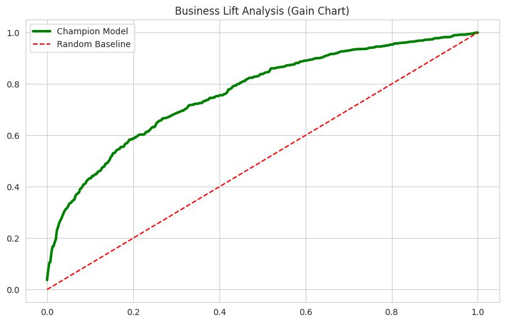
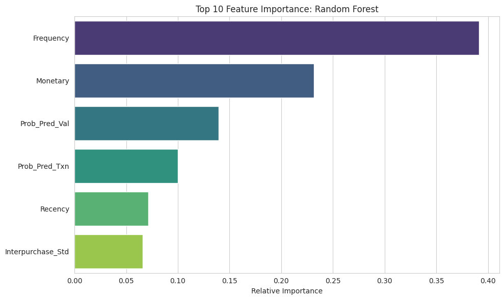
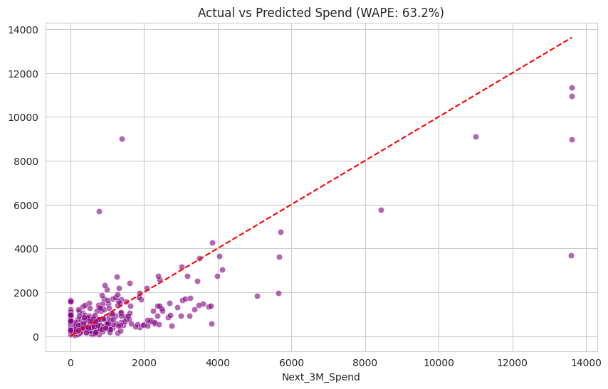

# Enterprise Customer Lifetime Value (CLV) Prediction Engine


-success)


> **A Hybrid Probabilistic & Machine Learning Pipeline for E-Commerce Revenue Forecasting.**
> *Optimizing Customer Acquisition Costs (CAC) through accurate 90-day spend prediction.*

---

## Executive Summary & Business Case

In e-commerce, predicting future customer spend is a notoriously difficult machine learning challenge. Traditional regression fails because retail data is fundamentally **zero-inflated** (many customers never return) and highly skewed (a few "whales" drive the majority of revenue).

This project implements a production-grade **Hybrid Pipeline** to predict 90-day Customer Lifetime Value (CLV) based on historical transaction logs. By accurately identifying which customers will generate the most future value, businesses can aggressively target high-value retention campaigns and stop wasting marketing budget on churned users.

---

## Technical Architecture & Methodology

To handle the heavy-tailed nature of spend data, this pipeline avoids standard linear regression in favor of a robust, two-stage hybrid approach:

### 1. BTYD Probabilistic Modeling (The "Priors")
We utilize the `Lifetimes` library to fit **Beta-Geometric/Negative Binomial (BG/NBD)** and **Gamma-Gamma** models. This extracts deep, behavioral probabilistic features that standard RFM analysis misses:
* `Prob_Alive`: The mathematical probability that a customer hasn't permanently churned.
* `Exp_Purchases`: Conditional expected number of future transactions.

### 2. Feature Engineering
We combine the probabilistic outputs with standard **RFM (Recency, Frequency, Monetary)** metrics and standard deviation of interpurchase time to create a rich, multidimensional customer profile.

### 3. Advanced Machine Learning (The "Engine")
We evaluated a robust Model Zoo (including Tweedie Regression to mathematically model sparse, non-negative continuous data). **Random Forest** emerged as the champion model, capturing the complex, non-linear relationships between purchase frequency and future spend.

---

## Evaluation & Leaderboard

Models were evaluated on a strictly isolated, out-of-time test set. The Champion Model outperformed the Naive Baseline (historical average) by a massive margin.

| Model | RMSE ($) | MAE ($) | R² Score |
| :--- | :--- | :--- | :--- |
| **Random Forest (Champion)** | **$1057.78** | **$593.69** | **0.640** |
| Linear Regression | $1153.79 | $639.03 | 0.572 |
| Ridge (L2) | $1159.00 | $640.82 | 0.568 |
| ElasticNet | $1240.52 | $671.10 | 0.505 |
| Tweedie Regressor | $1271.45 | $661.78 | 0.480 |
| *Naive Baseline* | *$1732.31* | *$792.59* | *0.036* |

**Final Business Metric:** WAPE (Weighted Absolute Percentage Error): **63.16%**

---

## Visual Evidence (Business Impact)

### 1. Business Lift Analysis (The ROI Chart)
*This gain chart proves the business value. By targeting the top 20% of customers identified by our model, the business captures nearly 60% of total future revenue, drastically outperforming random marketing.*


### 2. Feature Importance (The "Why")
*The Random Forest relies heavily on Frequency and Monetary value, but notice how the Probabilistic Features (`Prob_Pred_Val`, `Prob_Pred_Txn`) engineered via the BTYD models drive the predictive power.*


### 3. Actual vs. Predicted Spend (Statistical Validation)
*Model predictions cluster closely around the line of best fit, especially for low-to-medium spenders, successfully handling the zero-inflation problem.*


---

## Repository Structure

```text
clv-prediction-engine/
│
├── artifacts/                  # Auto-generated outputs
│   ├── data/                   # Raw & Processed Datasets (Git-ignored)
│   ├── graphs/                 # Visualizations (Lift, Importance, Accuracy)
│   └── models/                 # Serialized Champion Models (Git-ignored)
│
├── notebooks/
│   └── main_execution.ipynb    # Main Driver Script (Colab / Jupyter)
│
├── src/                        # Modularized Source Code
│   ├── __init__.py
│   ├── config.py               # Centralized hyperparameters & paths
│   ├── data_ingestion.py       # Automated fetching & preprocessing
│   ├── feature_engineering.py  # BTYD & RFM feature generation
│   ├── modeling.py             # Model Zoo & Training Pipeline
│   └── evaluation.py           # Metrics Calculation & Plotting
│
├── .gitignore                  # Version control exclusions
├── README.md                   # Project Documentation
└── requirements.txt            # Dependencies

 How to Run
This pipeline is optimized for Google Colab with seamless Google Drive integration.

Clone & Upload: Download this repository and upload the folder to your Google Drive.

Execute: Open notebooks/main_execution.ipynb in Google Colab.

Run All Cells: The script will automatically fetch the dataset, engineer the probabilistic features, train the model zoo, and serialize the champion pipeline.