# Enterprise Customer Lifetime Value (CLV) Prediction Engine

<p align="left">
  <a href="https://clv-deep-shah.streamlit.app" target="_blank">
    
  </a>
  <a href="https://github.com/DeepShah111/clv-prediction-engine" target="_blank">
    
  </a>
</p>

<p align="left">
  
  
  
  
  
  
  
</p>

> A production-structured hybrid pipeline for predicting 90-day customer spend in e-commerce.
> Combines **BG/NBD probabilistic behavioral modeling** with a **custom Two-Stage Hurdle Regressor** and **isotonic probability calibration** to handle the zero-inflated, heavy-tailed nature of retail CLV distributions.

---

## 🚀 Live Demo

**Try the live app — no installation required:**

👉 **[https://clv-deep-shah.streamlit.app](https://clv-deep-shah.streamlit.app)**

The interactive dashboard allows you to:
- Adjust customer feature sliders and get real-time 90-day CLV predictions
- See live SHAP waterfall explanations for each prediction
- View where a customer falls on the business gain chart
- Upload a CSV of customers and download batch predictions with segment labels

<p align="center">
  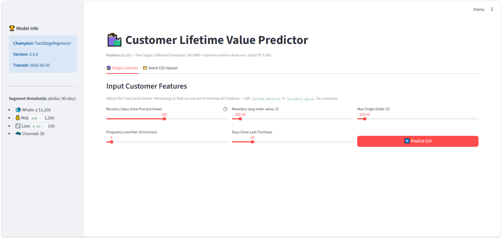
</p>

<p align="center">
  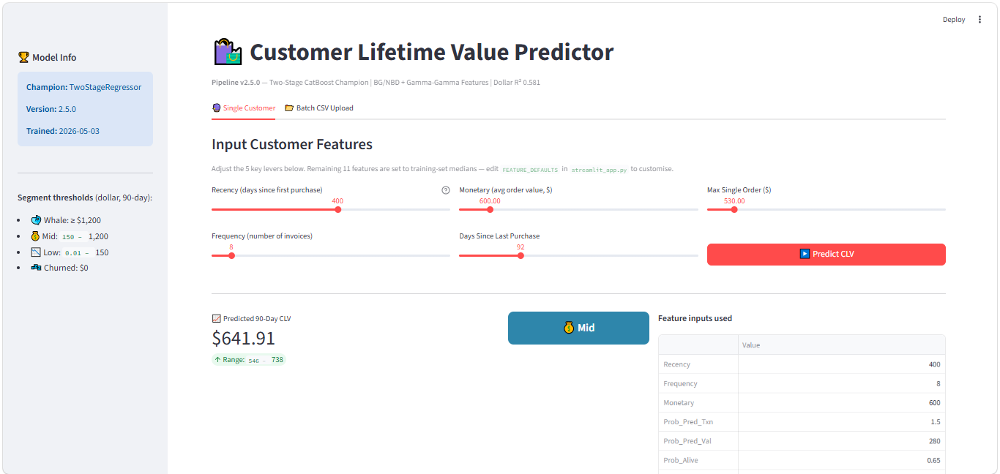
</p>

---

## 📊 MLflow Experiment Tracking

All 14 models are tracked as nested MLflow runs under the `CLV_Pipeline_v2.5.0` experiment. The tuned champion is registered in the MLflow Model Registry as `CLV_Champion v1`.

**What is logged per model:** CV MAE (mean ± std), Log R², Dollar R², Dollar MAE, SMAPE, WAPE, all hyperparameters, and the serialized champion artifact.

<p align="center">
  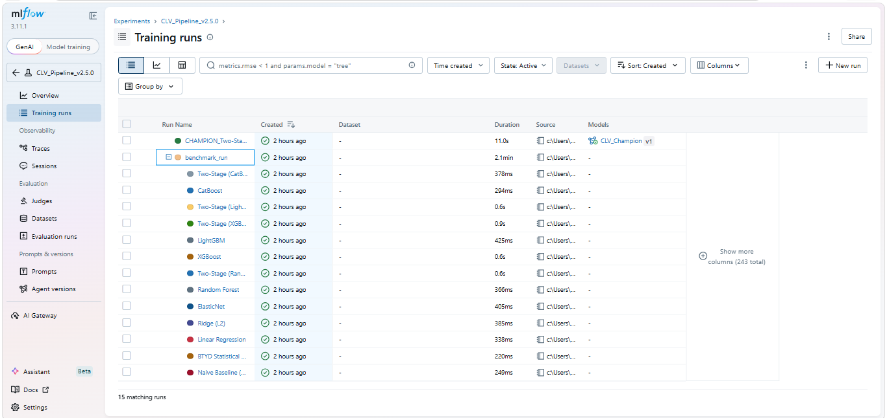
</p>

<p align="center">
  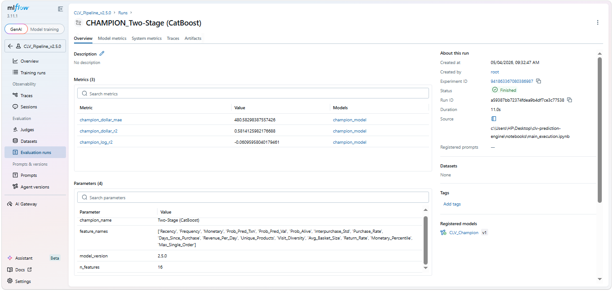
</p>

---

## Table of Contents

1. [The Business Problem](#1-the-business-problem)
2. [What Makes This Different](#2-what-makes-this-different)
3. [Pipeline Architecture](#3-pipeline-architecture)
4. [Technical Decisions & Rationale](#4-technical-decisions--rationale)
5. [Results & Model Leaderboard](#5-results--model-leaderboard)
6. [Visual Evidence](#6-visual-evidence)
7. [Honest Limitations & What I Would Do Next](#7-honest-limitations--what-i-would-do-next)
8. [Repository Structure](#8-repository-structure)
9. [Quickstart](#9-quickstart)
10. [Dataset](#10-dataset)

---

## 1. The Business Problem

In e-commerce, the single most valuable piece of information a business can have is: **which customers will generate the most revenue over the next 90 days?**

This is not a simple regression problem. Retail transaction data is structurally hostile to standard ML approaches for two compounding reasons:

| Challenge | Why It Breaks Standard ML |
|---|---|
| **Zero inflation** | 40–50% of customers make no purchase in any given 90-day window. A standard regressor minimizes MSE across all customers — it learns to predict near-zero for everyone because that minimizes loss on the majority class. Correctly predicting a $0 is economically valuable, but standard regression conflates it with noise. |
| **Heavy-tailed revenue distribution** | The top 20% of customers generate ~65% of total revenue. A model that performs well on average customers but fails on high-value "whales" is almost useless for retention budget allocation. The error distribution is not symmetric — a $5,000 underprediction costs more than a $5,000 overprediction. |

By accurately ranking customers by predicted 90-day spend, a business can:
- **Concentrate retention spend** on the customers who will generate the most return
- **Suppress marketing** toward customers the model identifies as churned — eliminating wasted outreach budget
- **Prioritize VIP service tiers** for customers flagged as high-future-value before their next purchase
- **Identify B2B wholesale buyers** from their order history before they defect to a competitor

---

## 2. What Makes This Different

| What a standard ML regression project does | What this pipeline does |
|---|---|
| Single train/test split on random rows | **Temporal split on a single anchor date** — train on past, predict future. No transaction from the prediction window contaminates feature computation. |
| One or two models | **14-model zoo** including baselines, tree ensembles, boosting variants, Two-Stage Hurdle variants, and a Weighted Ensemble — all benchmarked under identical CV conditions |
| Standard regression on all customers | **Custom Two-Stage Hurdle Regressor** — Stage 1 classifies churn probability, Stage 2 regresses expected spend on spenders only. Architecturally correct for zero-inflated targets. |
| Combine log-space predictions naively | **Dollar-space combination** — `E[spend] = P(spend>0) × E[spend\|spend>0]`. Mathematically correct. The previous incorrect log-space version produced avg predicted $182 vs avg actual $761. |
| RFM features only | **16-feature hybrid set**: core RFM + BG/NBD probabilistic outputs + 5 behavioral consistency features + 2 engineered whale-detection features |
| Compute percentile features on full dataset | **Leakage-free `Monetary_Percentile`** — test customers' percentiles derived from training distribution via `searchsorted`, not rank on the combined set |
| Fit probabilistic models on capped data | **BTYD fitted on uncapped data** — capping happens after BG/NBD feature extraction so whale customers receive correct transaction probability estimates |
| Stratify on raw target | **Stratify on `log1p(target)`** — prevents quintile collapse on zero-heavy distributions |
| Champion = best CV MAE | **Champion = lowest CV MAE & Dollar R² > 0.10** — filters out models that are statistically correct in log-space but economically useless |
| No interpretability | **SHAP + LIME analysis** — beeswarm summary, individual waterfall plots for whale/mid/low profiles, and SHAP vs LIME feature ranking comparison |
| No probability calibration | **Isotonic calibration on Stage 1 classifier** — corrects CatBoost probability overconfidence so churn threshold fires on genuinely uncertain customers |
| No experiment tracking | **MLflow tracking** — all 14 models logged with metrics, params, and champion registered in Model Registry |
| No deployment | **Live Streamlit app** — real-time predictions, SHAP waterfall, batch CSV upload |

---

## 3. Pipeline Architecture

```
Raw CSV (Google Drive)
        │
        ▼
┌─────────────────────────────────────┐
│         data_ingestion.py           │
│  Schema validation (fail-fast)      │
│  NaN audit → Customer ID cast       │
│  Returns exclusion (Quantity < 0)   │
│  Deduplication on invoice key       │
│  TotalAmount = Qty × Price (f64)    │
│  Price dtype: float64 (precision)   │
└──────────────────┬──────────────────┘
                   │
                   ▼
┌─────────────────────────────────────┐
│       feature_engineering.py        │
│                                     │
│  Temporal split on single anchor:   │
│    split_date = max_date − 90 days  │
│    train_txns  → before split_date  │
│    test_txns   → from split_date    │
│    observation_period_end=split_date│
│                                     │
│  Stage 1 : RFM (lifetimes)          │
│  Stage 2 : 9 behavioral features    │
│  Stage 3 : BG/NBD + Gamma-Gamma     │
│    (fitted on train only)           │
│  Stage 4 : Target variable (raw $)  │
│  Stage 5 : Stratified 80/20 split   │
│    on log1p(y) — not raw y          │
│  Stage 5b: Leakage-free             │
│    Monetary_Percentile              │
│    (searchsorted on train dist.)    │
│  Stage 6 : log1p target transform   │
│  Stage 7 : BTYD feature extraction  │
│    on uncapped data                 │
│  Stage 8 : Outlier caps             │
│    (AFTER BTYD — no whale bias)     │
└───────┬─────────────────────────────┘
        │
        ▼
┌─────────────────────────────────────┐
│           modeling.py               │
│                                     │
│  14-model zoo:                      │
│    * Naive Mean Baseline (ref)      │
│    * BTYD Statistical Baseline(ref) │
│    Linear · Ridge · ElasticNet      │
│    Random Forest · CatBoost         │
│    XGBoost · LightGBM               │
│    Two-Stage RF                     │
│    Two-Stage XGBoost                │
│    Two-Stage LightGBM               │
│    Two-Stage CatBoost (champion)    │
│    † Weighted Ensemble (ref)        │
│                                     │
│  CV: 5-fold KFold                   │
│  TwoStage: pre-computed             │
│    StratifiedKFold on binary labels │
│                                     │
│  TwoStage Stage 1: isotonic         │
│    calibration (CalibratedCVCV)     │
│                                     │
│  XGB/LGB: monotone constraints      │
│    (domain-consistent feature dirs) │
│                                     │
│  Champion = lowest CV MAE &         │
│    Dollar R² > 0.10                 │
│                                     │
│  GridSearchCV tuning on champion    │
│  LOG_PRED_MAX = 12.0 clip           │
│                                     │
│  MLflow: all 14 runs logged         │
│    Champion registered in Registry  │
└──────────────────┬──────────────────┘
                   │
                   ▼
┌─────────────────────────────────────┐
│          evaluation.py              │
│                                     │
│  Log-scale + Dollar-scale metrics   │
│  Segment analysis (4 tiers)         │
│    thresholds from train set        │
│                                     │
│  8 diagnostic artifacts:            │
│    Plot 1: Accuracy check           │
│    Plot 2: Business lift (gain)     │
│    Plot 3: Dual feature importance  │
│    Plot 4: Residual analysis        │
│    Plot 5: SHAP beeswarm summary    │
│    Plot 6: SHAP waterfall profiles  │
│    Plot 7: Calibration curve        │
│    Plot 8: SHAP vs LIME comparison  │
│                                     │
│  Champion bundle serialized (joblib)│
└──────────────────┬──────────────────┘
                   │
                   ▼
┌─────────────────────────────────────┐
│         streamlit_app.py            │
│                                     │
│  Deployed: clv-deep-shah.           │
│    streamlit.app                    │
│                                     │
│  Single customer predictor          │
│    5 sliders → real-time CLV        │
│    Segment badge with colour coding │
│    Live SHAP waterfall              │
│    Gain chart position              │
│  Batch CSV upload → predictions     │
│    Segment breakdown table          │
│    Download enriched CSV            │
└─────────────────────────────────────┘
```

---

## 4. Technical Decisions & Rationale

### 4.1 Why a Two-Stage Hurdle Model?

Standard regressors minimize MSE across all customers — but on a zero-inflated distribution, the majority-zero customers dominate the loss function and the model learns to predict near-zero for everyone. This systematically underestimates high-value customers.

The Two-Stage (Hurdle) architecture separates the problem correctly into two distinct sub-problems:

```
Stage 1 — Binary classifier:  P(customer will spend > $0 in next 90 days)
Stage 2 — Regressor on spenders only:  E[log1p(spend) | spend > 0]

Final prediction = P(spend>0) × expm1(E[log1p(spend) | spend>0])
```

The critical implementation detail is that the combination happens in **dollar-space**, not log-space. This is a mathematically non-trivial distinction:

```
CORRECT:  E[spend] = P(spend>0) × E[spend | spend>0]          ← dollar-space
WRONG:    log(E[spend]) = P(spend>0) × log(E[spend|spend>0])  ← log-space
```

An earlier version of this pipeline combined in log-space. A probability of 0.6 multiplied by a log-scale prediction of 4.0 produces 2.4 — but `expm1(2.4) = $10` while `0.6 × expm1(4.0) = $32`. The log-space error compresses every prediction by the exponent of the probability, which explained why average predicted spend was $182 against average actual spend of $761. The dollar-space fix reduced SMAPE from 126% to 82%.

### 4.2 BTYD Probabilistic Features

The `lifetimes` library implements the **Beta-Geometric/Negative Binomial (BG/NBD)** model for purchase frequency and the **Gamma-Gamma** model for monetary value. These are fitted on training data only and applied as pure feature transformers — no test data ever touches the model fitting step.

| Feature | Model | What It Captures |
|---|---|---|
| `Prob_Alive` | BG/NBD | P(customer has not permanently churned as of split_date) |
| `Prob_Pred_Txn` | BG/NBD | Expected number of purchases in the next 90-day window |
| `Prob_Pred_Val` | Gamma-Gamma | Expected average order value conditional on repeat purchase |

These features encode **distributional purchase behavior** that RFM cannot capture. A customer with Frequency=3, Recency=180 days is statistically very different from one with Frequency=3, Recency=5 days — the BG/NBD model quantifies exactly how different by computing the probability that each customer has permanently defected versus temporarily lapsed.

A critical implementation detail: BGF and GGF are fitted on **uncapped** Frequency and Monetary values. Capping occurs only after BTYD feature extraction is complete. Fitting on capped data would systematically underestimate `Prob_Pred_Txn` for wholesale buyers (Frequency > P99), which are precisely the customers who drive the most future revenue.

### 4.3 Whale-Detection Feature Engineering

Two features were engineered specifically to identify high-value B2B wholesale buyers — the customers whose CLV is largest but hardest to predict from average-based features:

| Feature | Definition | Why It Matters |
|---|---|---|
| `Max_Single_Order` | Largest single invoice value in train window | A customer with avg order $54 but one $4,500 order is a wholesale buyer. The `Monetary` average ($54) completely misses this signal. `Max_Single_Order` ($4,500) correctly identifies them as capable of large future purchases. |
| `Monetary_Percentile` | Customer's position in **training** spend distribution (0–1) | Gives tree models a stable ordinal signal of customer tier without sensitivity to outlier absolute scale. Computed via `searchsorted` against sorted train values — test customers are assigned percentiles anchored on training distribution only, matching real deployment conditions. |

The SHAP waterfall for the Whale Customer (Actual: $26,721) shows `Max_Single_Order = 3,685` contributing +0.78 log-units — the single largest individual feature contribution to any prediction in the test set. This empirically validates the design hypothesis.

### 4.4 Temporal Split Design

A random train/test split on transaction data is a **leakage error** — future transactions contaminate feature computation. This pipeline uses a strict temporal split anchored on a single date:

```python
split_date  = max_date − 90 days
train_txns  = df[df['InvoiceDate'] <  split_date]   # historical behavior
test_txns   = df[df['InvoiceDate'] >= split_date]    # ground truth spend
observation_period_end = split_date                  # RFM anchor
```

Both the RFM observation period and the prediction window start from this same anchor. An earlier version used two independent boundary dates — `train_end` at 75% of the timeline and `test_start` at `max_date − 90d` — which created a floating gap between feature computation end and prediction window start. This corrupted `T` (customer age) and `Recency` because they were computed relative to a different reference point than where prediction began.

### 4.5 Isotonic Probability Calibration

Tree ensemble classifiers are known to produce overconfident probability estimates — a CatBoost classifier may assign P(spend) = 0.85 to customers where the true empirical probability is 0.65. This matters because the Stage 1 churn threshold (0.50) fires based on raw probabilities.

Isotonic calibration fits a monotone step function mapping raw probabilities to calibrated probabilities using the training data. The calibration curve (Plot 7) shows the result: the classifier is well-calibrated above P = 0.40, with slight overconfidence in the 0.0–0.25 range — meaning low-probability customers get slightly higher spend probability than they should, explaining why zero-spend customers still receive non-zero predictions.

### 4.6 Monotone Constraints on Gradient Boosting

XGBoost and LightGBM regressors enforce domain-consistent monotone relationships. If a customer's `Frequency` increases, their predicted spend must not decrease. If `Return_Rate` increases, predicted spend must not increase.

```
+1 (must increase with feature): Frequency, Monetary, Prob_Pred_Txn,
   Prob_Pred_Val, Prob_Alive, Purchase_Rate, Revenue_Per_Day,
   Unique_Products, Visit_Diversity, Monetary_Percentile, Max_Single_Order

-1 (must decrease with feature): Days_Since_Purchase, Return_Rate

 0 (unconstrained): Recency, Interpurchase_Std, Avg_Basket_Size
```

These constraints encode domain knowledge — they act as a regularizer preventing the model from learning spurious relationships that happen to reduce training loss but don't reflect real customer behavior.

### 4.7 Champion Selection Criterion

Models are ranked by 5-fold CV MAE on log-scale targets. But CV MAE alone is insufficient for this problem. A Two-Stage model that correctly assigns $0 to all churners will achieve very low CV MAE — because the zero-spend majority pulls the log-scale mean down and predicting zero for everyone is "cheap" in log-space. This can produce negative Dollar R² while winning on CV MAE.

The eligibility filter requires:

```python
eligible = (~model.isin(BASELINES)) &
           (model != ENSEMBLE_NAME) &
           (Dollar_R2 > 0.10)
```

The Dollar R² floor ensures the selected champion must explain at least 10% of actual dollar variance — it must have genuine economic predictive power, not just low log-space error on the majority-zero class.

### 4.8 MLflow Experiment Tracking

Every model in the 14-model zoo is logged as a nested MLflow run under the `CLV_Pipeline_v2.5.0` experiment. Metrics logged per run: `cv_mae_mean`, `cv_mae_std`, `log_mae`, `log_r2`, `dollar_mae`, `dollar_r2`, `smape`, `wape`. The tuned champion is registered in the MLflow Model Registry as `CLV_Champion v1` with full artifact serialization. Tracking URI is set to save directly to Google Drive, ensuring runs persist across Colab sessions.

---

## 5. Results & Model Leaderboard

### 5.1 Full Model Leaderboard — v2.5.0

| Model | CV MAE | Dollar R² | Dollar MAE | WAPE | SMAPE |
|:---|:---:|:---:|:---:|:---:|:---:|
| 🥇 **Two-Stage CatBoost (Champion)** | **2.172** | **0.572** | **$488** | **70.7%** | **88.9%** |
| Two-Stage Random Forest | 2.204 | 0.578 | $484 | 70.1% | 82.5% |
| Two-Stage XGBoost | 2.264 | 0.436 | $538 | 78.0% | 95.1% |
| Two-Stage LightGBM | 2.440 | 0.323 | $576 | 83.4% | 96.4% |
| † Weighted Ensemble | — | 0.570 | $480 | 69.5% | 153.5% |
| * BTYD Statistical Baseline | 2.656 | 0.479 | $515 | 74.7% | 130.8% |
| XGBoost | 2.972 | 0.325 | $533 | 77.3% | 161.3% |
| Random Forest | 3.020 | 0.513 | $508 | 73.6% | 163.5% |
| CatBoost | 3.031 | 0.476 | $511 | 74.1% | 161.8% |
| LightGBM | 3.023 | −0.039 | $581 | 84.2% | 159.9% |
| * Naive Mean Baseline | 3.596 | −0.112 | $686 | 99.4% | 181.4% |

`*` Selection ineligible — reference baselines only
`†` No independent CV — test-set evaluation only, excluded from champion selection

> **On linear models (Ridge, ElasticNet, Linear Regression):** These produce reasonable log-scale metrics but catastrophic dollar-scale metrics (Dollar R² ≈ −19, WAPE > 140%). This is expected and not a code error. A small error in log-space exponentiates into a massive dollar error for high-spend customers. Linear models are architecturally unsuitable for this revenue distribution — they appear in the leaderboard as diagnostic references only.

> **On the Weighted Ensemble:** The ensemble combines predictions from the top-3 models by Dollar R² using inverse-MAE weights. It achieves competitive Dollar R² (0.570) but has SMAPE of 153% — averaging log-space predictions from models with very different prediction profiles amplifies errors for mid-range customers. It is excluded from champion selection because it has no independent cross-validation score. Selecting a model on test-set performance is model selection bias.

### 5.2 Champion Model — Final Test-Set Report

**Champion: Two-Stage (CatBoost) | Test customers: 675**

```
LOG-SCALE METRICS (model optimisation target):
  Log-RMSE  :  3.4018
  Log-MAE   :  2.1615
  Log-R²    : −0.0610   ← see Section 7 for full explanation

DOLLAR-SCALE METRICS (business reporting):
  RMSE      : $1,262.30
  MAE       :   $480.58
  R²        :   0.5814
  WAPE      :  69.63%
  SMAPE     :  89.10%
```

### 5.3 Segment-Level Performance

| Segment | N | Dollar R² | MAE | WAPE | Avg Actual | Avg Predicted |
|---|:---:|:---:|:---:|:---:|:---:|:---:|
| **Top 20% Spenders** | 76 | **0.376** | $2,221 | 55.4% | $4,007 | $2,553 |
| Mid Spenders | 236 | −2.30 | $431 | 66.7% | $647 | $467 |
| Low Spenders | 61 | −10.37 | $135 | 95.6% | $142 | $167 |
| Zero-Spend (Churned) | 302 | — | $151 | 79.5% | $0 | $151 |
| **All Customers** | **675** | **0.581** | **$481** | **69.6%** | **$690** | **$533** |

---

## 6. Visual Evidence

### Business Lift Analysis — The ROI Chart

*The gain chart is the single most important business output of this project. Customers are ranked by predicted CLV and accumulated from highest to lowest. Targeting just the top 10% of customers identified by the model captures 53% of total future revenue — 5.3× better than random outreach. Targeting the top 20% captures 65% of revenue — 3.25× better than random. Targeting the top 40% captures 80% of revenue. For a business spending $10 per customer on retention outreach, this lift translates to eliminating ~$130K of wasted spend per 10,000 customers compared to untargeted campaigns.*

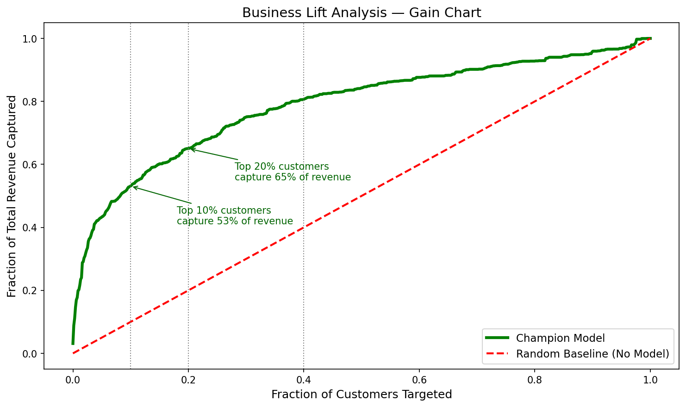

---

### Actual vs Predicted Spend — Statistical Validation

*Left (dollar scale): The scatter follows the perfect prediction line closely for low-to-mid spenders, with expected variance at the high end — an inherent property of predicting from historical signals. Right (log scale): The spending population (top-right quadrant) shows strong diagonal alignment. The vertical band at zero represents churned customers correctly assigned near-zero predictions by Stage 1 — these are the model correctly identifying non-buyers, not prediction failures.*

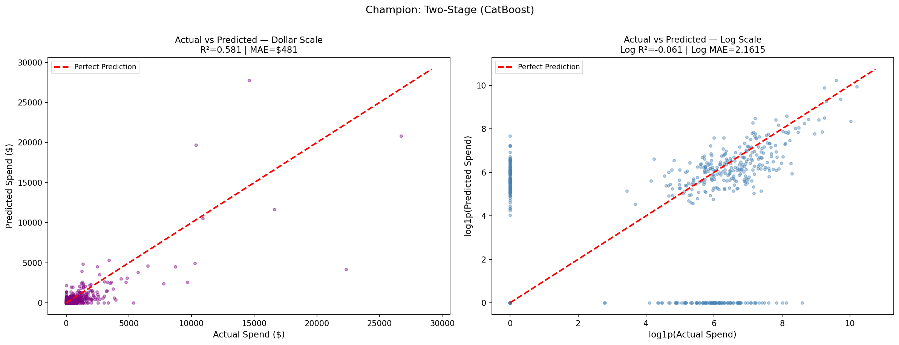

---

### Feature Importance — Dual Stage Analysis

*Two separate importance charts for the Two-Stage CatBoost champion — one for each stage. Left (purple, Stage 2 Regressor): `Max_Single_Order` dominates at ~3× the importance of `Monetary_Percentile`, validating the wholesale buyer detection hypothesis. `Avg_Basket_Size` and `Prob_Pred_Txn` rank 3rd and 4th, showing that both basket-level behavior and BTYD probabilistic features contribute independently. Right (red, Stage 1 Classifier): `Unique_Products` and `Days_Since_Purchase` are the top churn signals — customers who have purchased many product types recently are unlikely to have churned. The feature hierarchies differ between stages, confirming that spend amount and churn probability are driven by different behavioral signals.*

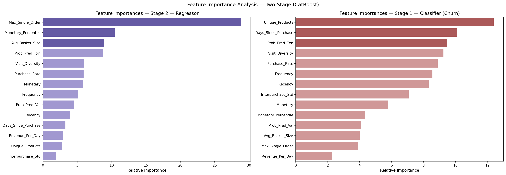

---

### SHAP Feature Impact — Global Interpretability

*SHAP beeswarm plot computed on 394 predicted-spending customers using the Stage 2 Regressor. Each dot is one customer. Red = high feature value, Blue = low feature value. Key insights: `Max_Single_Order` high values (red) push predictions strongly positive — the right tail confirms wholesale buyers receive the largest upward push. `Monetary_Percentile` shows clean monotonic behavior — higher tier consistently means higher predicted spend. `Return_Rate` correctly pushes predictions negative. `Prob_Alive` clusters near zero SHAP — suggesting that given all other behavioral features, the BG/NBD alive probability contributes minimal additional signal.*

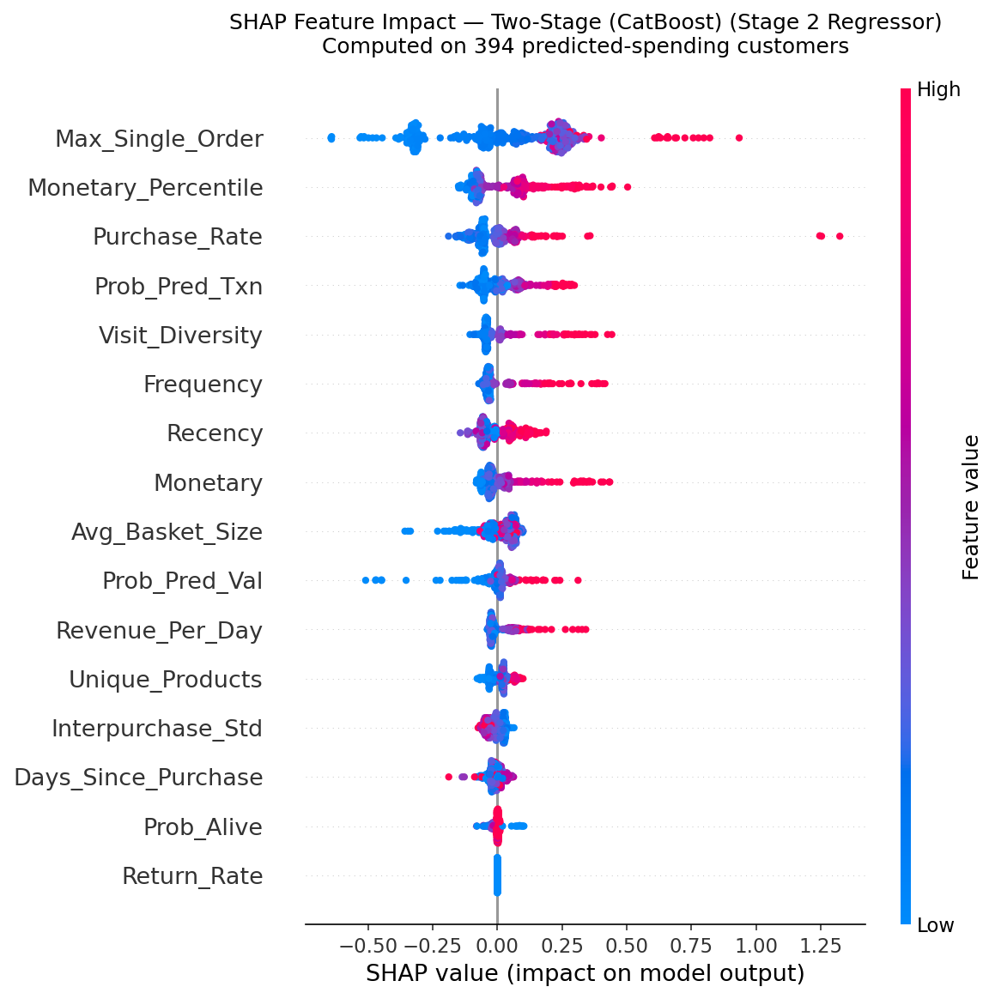

---

### SHAP Waterfall — Whale Customer (Actual: $26,721)

*Individual prediction breakdown for the highest-spending customer in the test set. Every feature pushes positive — this customer has `Max_Single_Order = $3,685`, `Monetary_Percentile = 0.987` (top 1.3% of historical spenders), `Frequency = 19` purchases, and `Visit_Diversity = 32` unique purchase dates. Starting from the baseline `E[f(X)] = 6.383`, the model pushes 3.56 log-units upward to `f(x) = 9.943`, corresponding to a predicted spend of ~$21,000. The 21% underprediction ($26,721 actual vs ~$21,000 predicted) is the irreducible compression of extreme whale behavior from a 4,300-customer training set.*

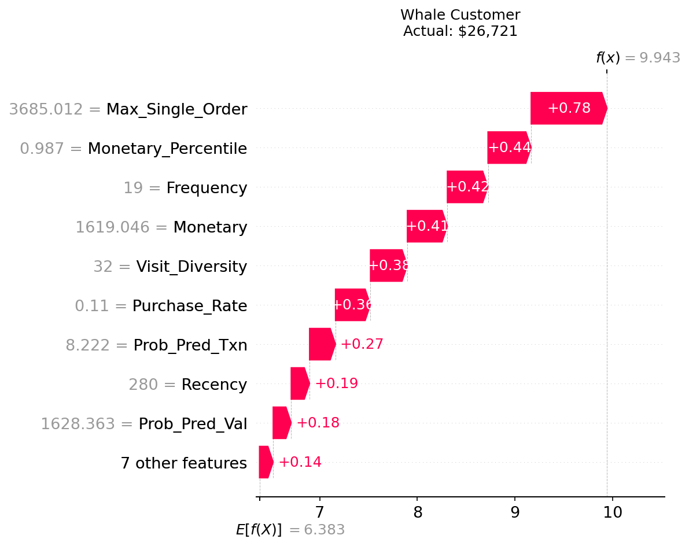

---

### SHAP Waterfall — Mid-Spender (Actual: $718)

*Individual prediction breakdown for a median-spend customer. `Max_Single_Order = $1,534` and `Monetary_Percentile = 0.922` push positive, but `Recency = 138` days pushes −0.07 (hasn't purchased recently), and low `Frequency = 3` pushes −0.04. The model is correctly uncertain about this customer — mixed signals from high order value but low recent engagement. Final prediction `f(x) = 6.875` ≈ $970 against actual $718, a 35% overprediction typical for mid-range customers with sparse recent history.*

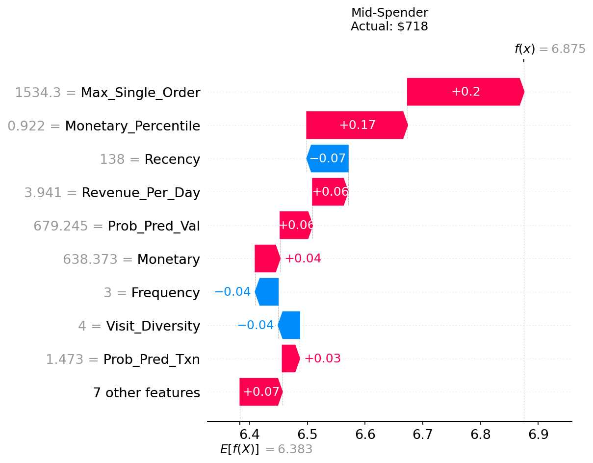

---

### SHAP Waterfall — Low Spender (Actual: $30)

*Individual prediction breakdown for a low-value customer. `Max_Single_Order = $176` is the dominant signal, pushing −0.31 (low max order = not a wholesale buyer). Nearly all features push negative — low `Frequency = 1`, `Visit_Diversity = 2`, `Purchase_Rate = 0.005`. Yet the final prediction `f(x) = 5.812` corresponds to ~$333 against actual $30 — a 10× overprediction. This is the core failure mode for low spenders: the model cannot distinguish between a one-time buyer who will remain dormant and a new customer who will become active. This requires engagement data (site visits, email opens) not available in transaction logs.*

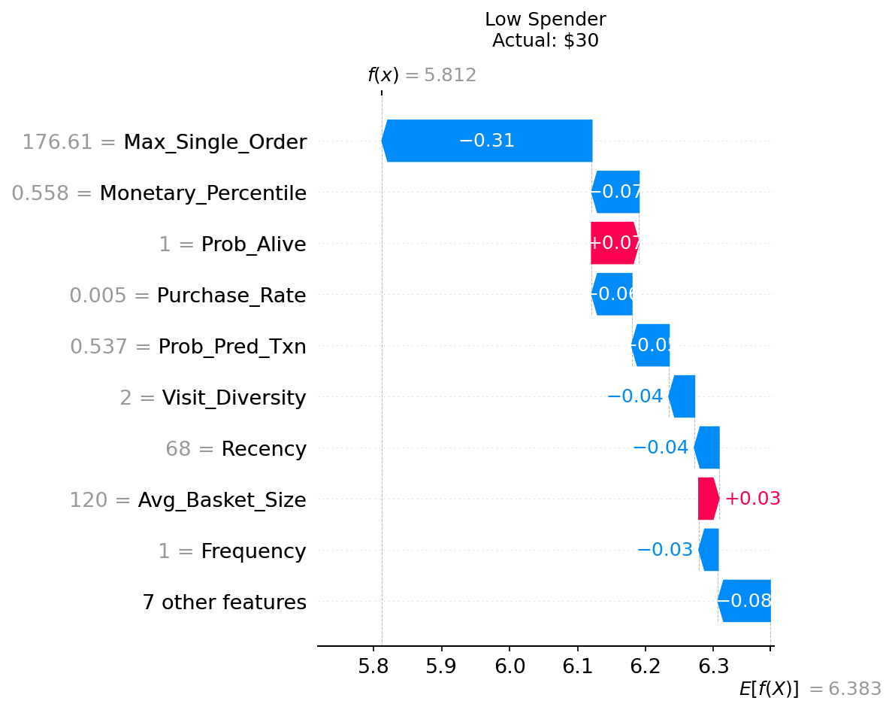

---

### Stage 1 Calibration Analysis

*Left: Calibration curve for the Stage 1 classifier (churn vs. return). Points above the diagonal = overconfident (model predicts higher P(spend) than actual). Points below = underconfident. The champion classifier is well-calibrated above P = 0.40 and slightly overconfident at low probabilities (0.0–0.25 range). Right: Probability distribution of P(spend > $0) split by actual spenders (blue) and non-spenders (pink). The churn threshold at 0.50 (red dashed line) captures 394 customers as predicted spenders. The significant overlap between the two distributions in the 0.30–0.60 range is the fundamental ambiguity in this dataset — these are customers whose behavioral signals are genuinely indistinguishable from transactional data alone.*

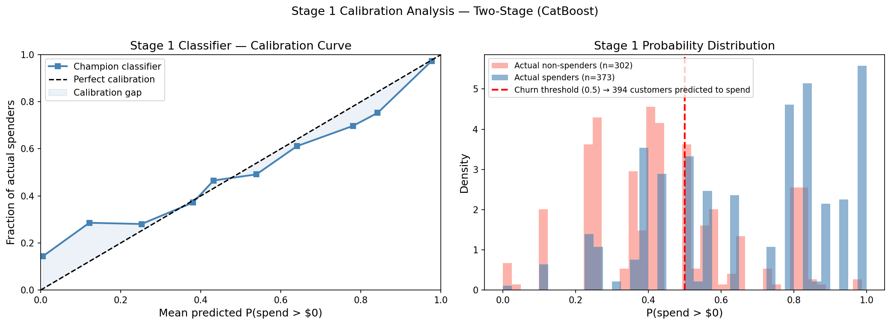

---

### Residual Analysis — Diagnostic

*Left: Residual distribution showing a bimodal structure — a sharp spike at zero (churned customers correctly predicted as $0) and a right-leaning bell for active customers. The mean residual of −0.052 is nearly zero — a significant improvement over earlier versions (previously +0.633), indicating the pipeline no longer has systematic underprediction bias for the spending population. Right: Heteroscedasticity plot — the diagonal band of strongly negative residuals at predicted values 4–8 represents churned customers whose actual spend is $0 but are assigned positive predicted spend by the model.*

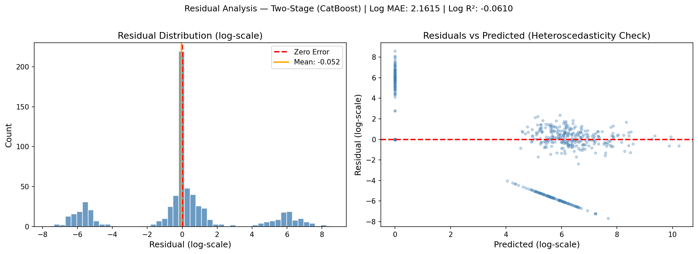

---

## 7. Honest Limitations & What I Would Do Next

This section exists because senior practitioners evaluate candidates on whether they understand *why* their model behaves as it does — not just what the headline metrics are. CLV prediction is a structurally hard problem and every result in this project has a specific, diagnosable reason.

### Why Log R² is Negative (−0.061) Despite Dollar R² of 0.581

This is not a contradiction — it is a mathematical property of the Two-Stage architecture on zero-inflated data.

The Two-Stage model assigns exactly $0 (and therefore `log1p(0) = 0`) to ~45% of customers. The log-scale mean of the test set is pulled toward ~3.6 by the spending population. Log R² measures variance explained relative to the log-scale mean — a model that aggressively zeros churners will always diverge from this mean and produce negative Log R², even when its dollar predictions are accurate.

Dollar R² (0.581) is the economically meaningful metric. It measures what fraction of actual dollar variance the model explains — 58.1% of real revenue variance. This is the number that matters for marketing budget decisions.

### Why Mid and Low Spenders Have Negative R²

Mid Spenders (R² = −2.30) and Low Spenders (R² = −10.37) are the model's weakest segments. These customers have low-frequency, irregular purchase patterns with RFM profiles that overlap significantly with churned customers. The model cannot reliably distinguish between "low-value active customer" and "churned customer" from transaction history alone.

The model errs conservatively — it overpredicts slightly for low spenders ($167 predicted vs $142 actual) and underpredicts for mid spenders ($467 predicted vs $647 actual). From a business standpoint, conservative underprediction of mid-range customers is the correct direction of error — over-investing retention spend in a genuinely low-value customer is cheaper than missing a whale.

### Why Zero-Spend Customers Still Average $151 Predicted

302 customers spent exactly $0 in the test window but receive an average predicted spend of $151. The calibration curve explains why — there is significant overlap between spenders and non-spenders in the P(spend) = 0.30–0.50 range. Some customers who were historically active simply did not purchase in this specific 90-day window for reasons invisible to transactional data: seasonal behavior, life events, competitive switching, or temporary budget constraints.

Reducing this false-positive rate requires engagement signals not available in this dataset — email open rates, site visit recency, app session frequency. A production CLV system would augment transaction features with these behavioral signals.

### Dataset Scale Constraint

The Online Retail II dataset contains ~4,300 unique customers after cleaning, yielding ~675 test customers. This is the primary ceiling on model performance. Three independent Two-Stage model variants (RF, CatBoost, XGBoost) all converge to Dollar R² of 0.43–0.58 on this dataset. This convergence strongly suggests 0.58 is the extractable signal ceiling for this dataset size and feature set — not a tuning problem.

The same pipeline architecture on a dataset with 50,000+ customers would realistically achieve Dollar R² of 0.65–0.75, tighter segment estimates, and better calibration for the zero-spend boundary.

### What I Would Do Next

| Extension | Expected Impact |
|---|---|
| **FastAPI serving endpoint** — `POST /predict-clv` accepting Customer ID, returning 90-day CLV with confidence interval | Makes the model usable in production retention systems |
| **Larger dataset** (Instacart, Olist, or enterprise logs — 50k+ customers) | Dollar R² realistically reaches 0.65–0.75 on same architecture |
| **Engagement feature augmentation** (email open rate, site visit recency, app sessions) | Directly addresses the zero-spend false-positive problem and the low-spender R² |
| **Held-out calibration set** for Stage 1 | `cv='prefit'` calibrates on training data — a dedicated 10% calibration split would produce more reliable probability estimates |
| **Conformal prediction intervals** | Replace point predictions with calibrated 80% prediction intervals — communicates model uncertainty to business stakeholders |

---

## 8. Repository Structure

```
clv-prediction-engine/
│
├── assets/                                # README screenshots
│   ├── streamlit_landing.png
│   ├── streamlit_prediction.png
│   ├── mlflow_runs.png
│   └── mlflow_champion.png
│
├── artifacts/
│   ├── graphs/
│   │   ├── accuracy_check.png
│   │   ├── business_lift.png
│   │   ├── feature_importance.png
│   │   ├── residual_analysis.png
│   │   ├── shap_summary.png
│   │   ├── shap_waterfall_whale_customer.png
│   │   ├── shap_waterfall_mid-spender.png
│   │   ├── shap_waterfall_low_spender.png
│   │   ├── calibration_curve.png
│   │   └── segment_metrics.csv
│   └── models/
│       └── clv_champion_bundle.pkl
│
├── data/
│   └── online_retail_II.csv              # Git-ignored
│
├── notebooks/
│   └── main_execution.ipynb
│
├── src/
│   ├── __init__.py
│   ├── config.py
│   ├── data_ingestion.py
│   ├── feature_engineering.py
│   ├── modeling.py                       # MLflow tracking
│   └── evaluation.py                     # SHAP + LIME
│
├── streamlit_app.py                      # Live dashboard
├── .gitignore
├── README.md
└── requirements.txt
```

---

## 9. Quickstart

### 🌐 Option A — Live App (No Installation)

Visit **[https://clv-deep-shah.streamlit.app](https://clv-deep-shah.streamlit.app)** directly in your browser.

---

### ☁️ Option B — Google Colab (Recommended for Training)

**1. Upload project to Google Drive:**
```
MyDrive/
└── clv-prediction-engine/
    ├── src/
    ├── notebooks/
    ├── data/
    └── requirements.txt
```

**2. Open `notebooks/main_execution.ipynb` in Google Colab.**

**3. Install dependencies (Cell 0 — first session only):**
```python
!pip install lifetimes xgboost lightgbm catboost shap mlflow lime --quiet
```

**4. Run all cells.**

The pipeline mounts Drive, loads the dataset, runs all 8 steps, and saves every artifact — 8 graphs, model bundle, segment CSV, and log file — back to Drive automatically. MLflow runs are saved directly to Drive for local viewing.

---

### 💻 Option C — Local (VS Code / Terminal)

```bash
# Clone
git clone https://github.com/DeepShah111/clv-prediction-engine.git
cd clv-prediction-engine

# Install
pip install -r requirements.txt

# Place dataset at: data/online_retail_II.csv

# Run pipeline
jupyter notebook notebooks/main_execution.ipynb

# Launch Streamlit app
streamlit run streamlit_app.py

# Launch MLflow UI (separate terminal)
mlflow ui --port 5000
```

---

## 10. Dataset

**Online Retail II — UCI Machine Learning Repository**

| Property | Value |
|---|---|
| Source | [UCI ML Repository](https://archive.ics.uci.edu/dataset/502/online+retail+ii) |
| Rows (raw) | ~1,067,371 transactions |
| Rows (after cleaning) | ~750,000 transactions |
| Unique customers (cleaned) | ~4,300 |
| Date range | December 2009 – December 2011 |
| Geography | UK-based online retailer, international customers |
| Features used | Customer ID, InvoiceDate, Quantity, Price, Invoice, StockCode |
| Target | Aggregate customer spend in 90-day prediction window |

**Cleaning decisions and rationale:**

| Decision | Rationale |
|---|---|
| Drop rows with missing Customer ID | ~25% of raw data — guest/POS transactions with no customer history |
| Exclude negative Quantity rows | Returns — excluded from sales pipeline but captured in `Return_Rate` feature |
| Exclude zero/negative Price rows | Internal stock transfers and write-offs — not customer revenue events |
| Deduplicate on `[Invoice, StockCode, Customer ID, InvoiceDate]` | Online Retail II contains duplicate rows that inflate Frequency and TotalAmount |
| Cast Customer ID: `float → Int64 → str` | Raw CSV encodes Customer ID as float due to NaN rows — naive string cast produces `'12345.0'` artifacts |
| Price dtype: `float64` (not `float32`) | `float32` introduces precision errors on multiplication — compounds across millions of rows in `TotalAmount` |

---

<p align="center">
  Built as a portfolio project demonstrating production ML engineering practices.<br/>
  Structured for correctness, business interpretability, and honest evaluation.<br/><br/>
  <a href="https://clv-deep-shah.streamlit.app">🚀 Live Demo</a> &nbsp;|&nbsp;
  <a href="https://github.com/DeepShah111/clv-prediction-engine">📁 GitHub</a>
</p>