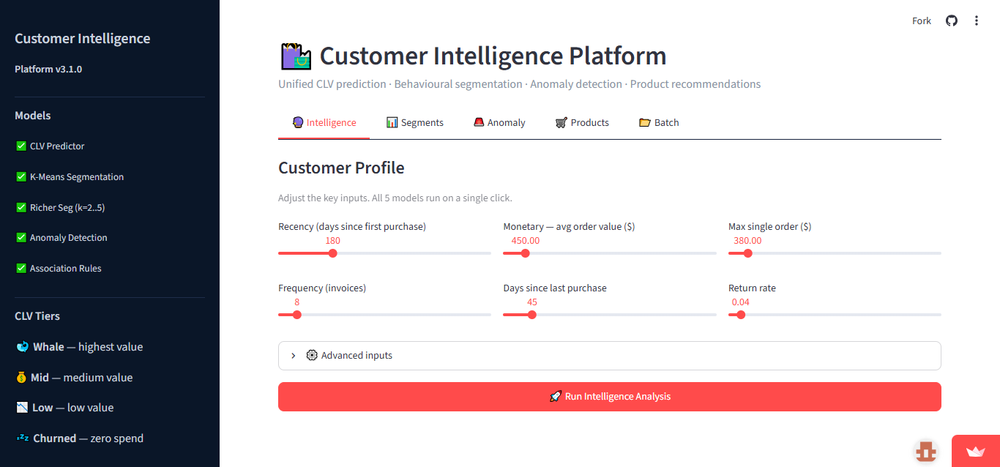
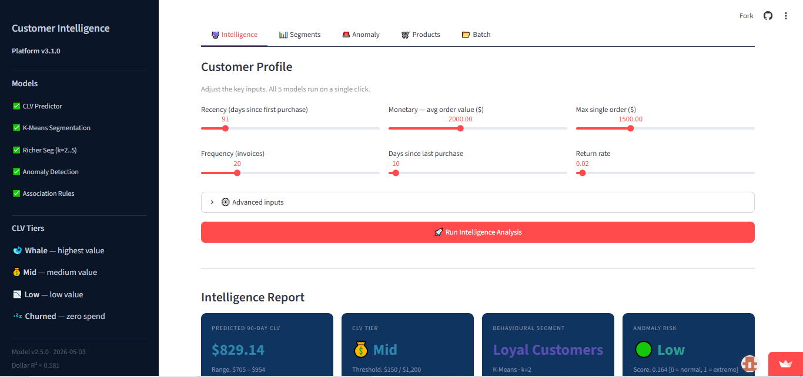
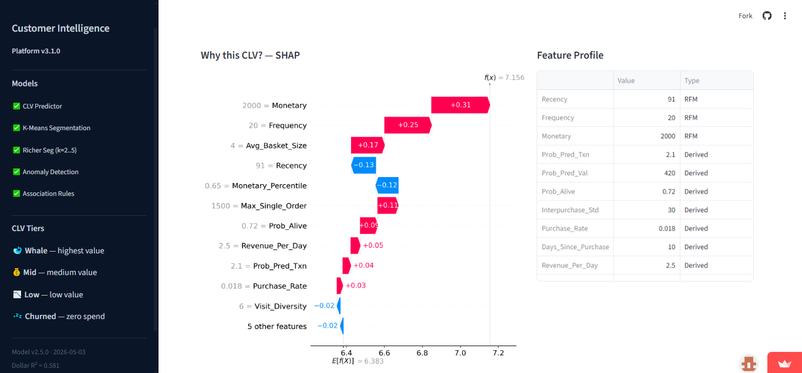
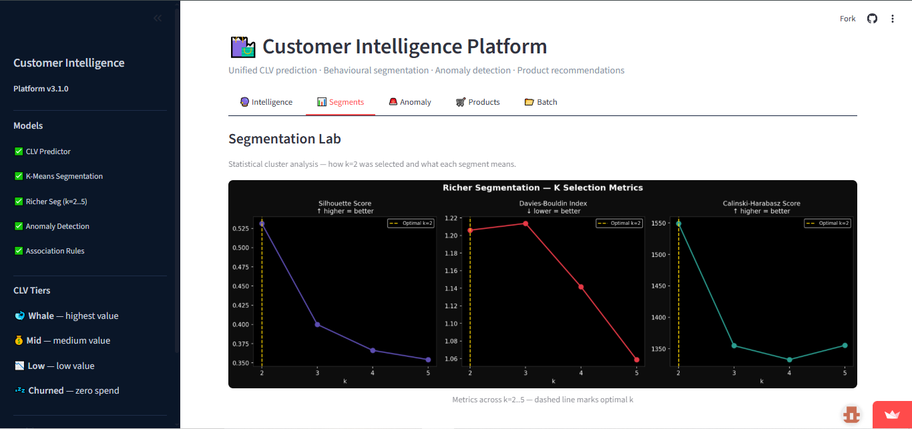
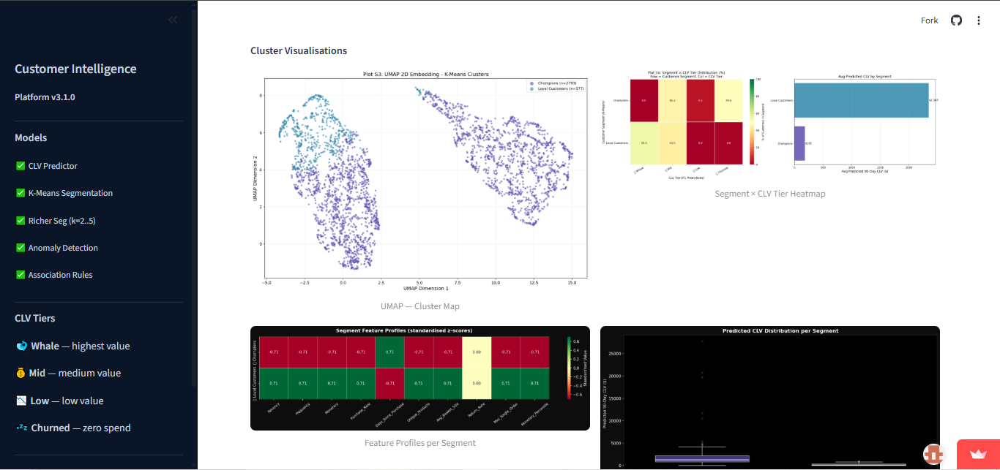
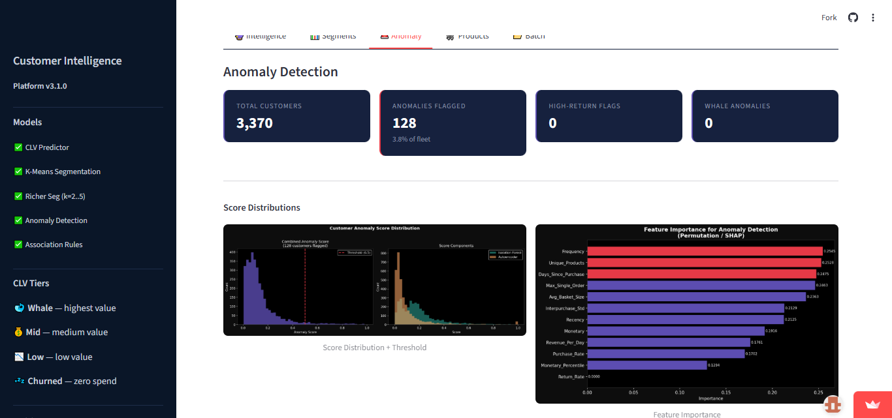
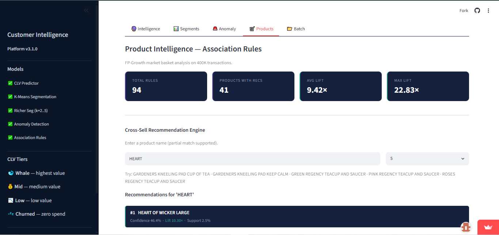
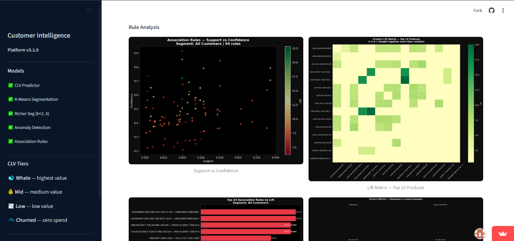
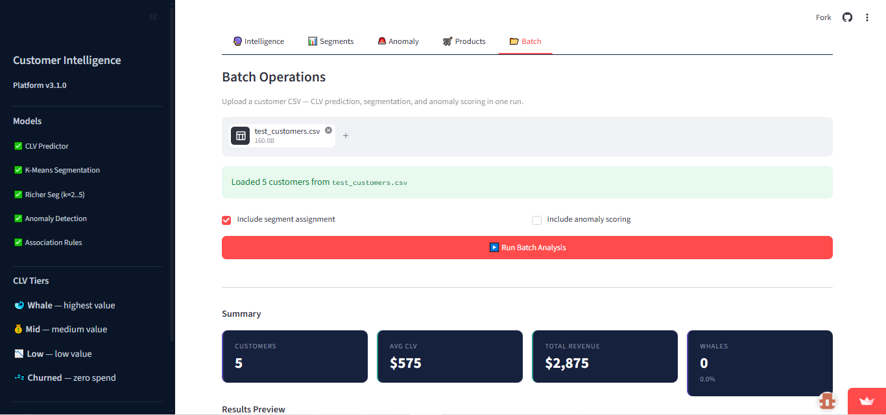
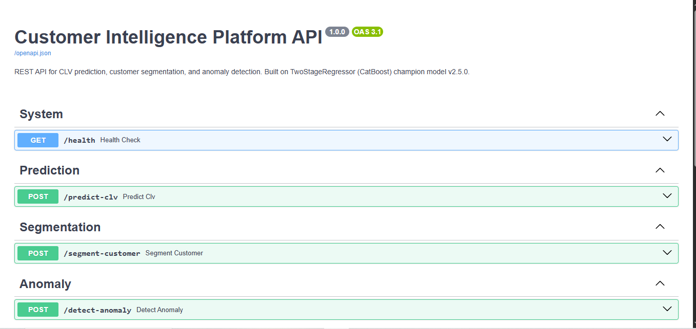

# 🛍️ Customer Intelligence Platform

<p align="left">
  <a href="https://clv-deep-shah.streamlit.app" target="_blank">
    
  </a>
  <a href="https://github.com/DeepShah111/clv-prediction-engine" target="_blank">
    
  </a>
</p>

<p align="left">
  
  
  
  
  
  
  
</p>

> A production-grade **Customer Intelligence Platform** built on the Online Retail II dataset.
> Combines a **Two-Stage CatBoost CLV predictor** (Dollar R² = 0.581) with **10 unsupervised models**
> — K-Means, DBSCAN, GMM, Hierarchical, PCA, UMAP, t-SNE, Isolation Forest, PyTorch Autoencoder,
> and FP-Growth Association Rules — all unified in a single 5-tab Streamlit dashboard with a
> production FastAPI endpoint, Dockerfile, and 52-test pytest suite.

---

## 🚀 Live Demo

**Try the platform — no installation required:**

👉 **[https://clv-deep-shah.streamlit.app](https://clv-deep-shah.streamlit.app)**

---

## 📸 Platform Screenshots

### Tab 1 — Unified Customer Intelligence
*All 5 models run simultaneously on a single customer profile. One click returns CLV prediction, K-Means segment, anomaly score, and business flags.*

<p align="center">
  
</p>

<p align="center">
  
</p>

<p align="center">
  
</p>

---

### Tab 2 — Segmentation Lab
*Statistical k-selection proof: tested k=2,3,4,5 with composite scoring across Silhouette, Davies-Bouldin, and Calinski-Harabasz. k=2 wins objectively.*

<p align="center">
  
</p>

<p align="center">
  
</p>

---

### Tab 3 — Anomaly Detection
*Isolation Forest + PyTorch Autoencoder ensemble. 128 customers flagged (3.8%) across 3,370 analysed.*

<p align="center">
  
</p>

---

### Tab 4 — Product Intelligence
*FP-Growth association rules on 400K transactions. 94 rules, avg lift 9.42×. Live cross-sell recommendation engine.*

<p align="center">
  
</p>

<p align="center">
  
</p>

---

### Tab 5 — Batch Operations + API + Tests

<p align="center">
  
</p>

<p align="center">
  
</p>

<p align="center">
  
</p>

---

## Table of Contents

1. [What This Platform Does](#1-what-this-platform-does)
2. [Architecture Overview](#2-architecture-overview)
3. [Supervised Learning — CLV Prediction](#3-supervised-learning--clv-prediction)
4. [Unsupervised Learning — All 10 Models](#4-unsupervised-learning--all-10-models)
5. [Model Leaderboard](#5-model-leaderboard)
6. [Key Configuration Variables](#6-key-configuration-variables)
7. [Technical Decisions & Rationale](#7-technical-decisions--rationale)
8. [Diagnostic Plots](#8-diagnostic-plots)
9. [Repository Structure](#9-repository-structure)
10. [Quickstart](#10-quickstart)
11. [API Reference](#11-api-reference)
12. [Dataset](#12-dataset)
13. [Honest Limitations](#13-honest-limitations)

---

## 1. What This Platform Does

In e-commerce, two questions drive the most revenue decisions:

1. **Which customers will spend the most in the next 90 days?** → Supervised CLV prediction
2. **Which customers are behaving unusually or buying together?** → Unsupervised intelligence

This platform answers both — not as separate notebooks, but as a unified production system
where every model feeds into a single customer view.

| Business Question | Model | Output |
|---|---|---|
| How much will this customer spend in 90 days? | Two-Stage CatBoost | Dollar CLV + confidence range |
| What type of customer are they behaviorally? | K-Means + DBSCAN + GMM + Hierarchical | Segment name + profile |
| Is this customer behaving anomalously? | Isolation Forest + Autoencoder | Anomaly score [0–1] + risk flags |
| What products should we recommend to them? | FP-Growth Association Rules | Top-N cross-sell recommendations |
| Which customers are worth retaining in bulk? | Batch scoring pipeline | Full CSV with CLV + segment + anomaly |

---

## 2. Architecture Overview

```
Raw CSV (Online Retail II — 1M+ transactions)
        │
        ▼
┌─────────────────────────────────────────────────────┐
│                 data_ingestion.py                   │
│  Schema validation · NaN audit · Returns exclusion  │
│  Deduplication · TotalAmount = Qty × Price (f64)    │
└────────────────────────┬────────────────────────────┘
                         │
                         ▼
┌─────────────────────────────────────────────────────┐
│               feature_engineering.py                │
│                                                     │
│  Temporal split:  split_date = max_date − 90 days   │
│  ├── RFM features (lifetimes)                       │
│  ├── 9 behavioral features                          │
│  ├── BG/NBD + Gamma-Gamma (train only)              │
│  ├── Leakage-free Monetary_Percentile               │
│  └── 16-feature hybrid output                       │
└──────────────┬──────────────────┬───────────────────┘
               │                  │
               ▼                  ▼
┌──────────────────┐   ┌──────────────────────────────┐
│   modeling.py    │   │      segmentation.py          │
│                  │   │  segmentation.py              │
│  14-model zoo    │   │  K-Means · DBSCAN · GMM       │
│  Two-Stage       │   │  Hierarchical · PCA           │
│  CatBoost        │   │  UMAP · t-SNE                 │
│  Champion        │   │                               │
│  Dollar R²=0.581 │   │      anomaly.py               │
│                  │   │  Isolation Forest             │
│   evaluation.py  │   │  PyTorch Autoencoder          │
│  SHAP + LIME     │   │                               │
│  8 diagnostic    │   │   association_rules.py        │
│  plots           │   │  FP-Growth · 94 rules         │
│                  │   │  9.42× avg lift               │
└──────────────────┘   └──────────────────────────────┘
               │                  │
               └────────┬─────────┘
                         │
                         ▼
┌─────────────────────────────────────────────────────┐
│              streamlit_app.py  (v3.1.0)             │
│                                                     │
│  Tab 1 — Unified Customer Intelligence              │
│  Tab 2 — Segmentation Lab                           │
│  Tab 3 — Anomaly Detection                          │
│  Tab 4 — Product Intelligence                       │
│  Tab 5 — Batch Operations                           │
└──────────────────────────┬──────────────────────────┘
                           │
                           ▼
┌─────────────────────────────────────────────────────┐
│                  api/main.py (FastAPI)               │
│  POST /predict-clv · POST /segment-customer         │
│  POST /detect-anomaly · GET /health                 │
└─────────────────────────────────────────────────────┘
```

---

## 3. Supervised Learning — CLV Prediction

### Why a Two-Stage Hurdle Model?

Retail CLV data has two structural problems that break standard regression:

| Problem | Impact | Solution |
|---|---|---|
| **Zero inflation** | 40–50% of customers spend $0. Standard regressors learn to predict near-zero for everyone. | Stage 1 binary classifier separates churners from spenders |
| **Heavy-tailed revenue** | Top 20% generate ~65% of revenue. A model wrong on whales is useless for retention. | Stage 2 regressor trained on spenders only, with whale-detection features |

```
Stage 1:  P(customer will spend > $0 in next 90 days)     [CatBoost Classifier]
Stage 2:  E[log1p(spend) | spend > 0]                     [CatBoost Regressor]

Final:    E[spend] = P(spend>0) × expm1(E[log1p(spend)|spend>0])
                     ↑ dollar-space combination — mathematically correct
```

### The 16 Features

| Feature | Category | What It Captures |
|---|---|---|
| `Recency` | Core RFM | Days since first purchase |
| `Frequency` | Core RFM | Number of invoices |
| `Monetary` | Core RFM | Average order value |
| `Prob_Pred_Txn` | BG/NBD | Expected transactions in next 90 days |
| `Prob_Pred_Val` | Gamma-Gamma | Expected avg order value |
| `Prob_Alive` | BG/NBD | P(customer has not permanently churned) |
| `Interpurchase_Std` | Behavioral | Consistency of purchase timing |
| `Purchase_Rate` | Behavioral | Purchases per day |
| `Days_Since_Purchase` | Behavioral | Days since last transaction |
| `Revenue_Per_Day` | Behavioral | Revenue per active day |
| `Unique_Products` | Behavioral | Breadth of product engagement |
| `Visit_Diversity` | Behavioral | Unique purchase dates |
| `Avg_Basket_Size` | Behavioral | Average items per order |
| `Return_Rate` | Behavioral | Fraction of orders returned |
| `Monetary_Percentile` | Whale Detection | Customer tier rank (leakage-free) |
| `Max_Single_Order` | Whale Detection | Largest single invoice value |

---

## 4. Unsupervised Learning — All 10 Models

### Customer Segmentation (7 models)

| Model | Purpose | Key Output |
|---|---|---|
| **K-Means** (primary) | Customer segmentation | k=2 optimal — Champions vs Loyal Customers |
| **DBSCAN + Optuna** | Noise-aware clustering | 2.4% noise points identified |
| **GMM** | Probabilistic soft clustering | Cluster membership probabilities |
| **Hierarchical** | Dendrogram analysis | Visual cluster hierarchy |
| **PCA** | Dimensionality reduction | 6 components, 96.8% variance explained |
| **UMAP** | 2D non-linear visualization | Cluster separation map |
| **t-SNE** | 2D manifold visualization | Local structure preservation |

**K-Selection Results** — tested k=2,3,4,5 with composite scoring:

| k | Silhouette | Davies-Bouldin | Calinski-H | Composite | |
|---|---|---|---|---|---|
| **2** | **0.5315** | **1.2060** | **1,549** | **0.7624** | ◄ OPTIMAL |
| 3 | 0.4000 | 1.2137 | 1,355 | 0.1548 | |
| 4 | 0.3662 | 1.1415 | 1,333 | 0.1504 | |
| 5 | 0.3542 | 1.0588 | 1,355 | 0.2761 | |

Composite score = 50% Silhouette + 25% (1 − Davies-Bouldin normalized) + 25% Calinski-Harabasz normalized.
Silhouette drops 0.53 → 0.35 as k increases — splitting further creates noise, not insight.

**Segment Business Summary:**

| Segment | N | Avg CLV | Total CLV | Revenue Share |
|---|---|---|---|---|
| 🐋 Loyal Customers | 110 | $2,342.59 | $257,685 | **71.6%** |
| 👥 Champions | 565 | $180.98 | $102,252 | 28.4% |

### Anomaly Detection (2 models)

| Model | Architecture | Role |
|---|---|---|
| **Isolation Forest** | 200 trees, contamination=5% | Primary anomaly scorer — fast, no distributional assumptions |
| **PyTorch Autoencoder** | Encoder 12→64→32→16→8, Decoder 8→16→32→64→12 | Deep reconstruction-error scorer |

**Ensemble:** `score = 0.45 × IF_score + 0.55 × AE_score`

**Business flags:**
- `is_anomaly` — combined score ≥ 0.50
- `is_high_return` — Return_Rate > 0.30 AND score > 0.40
- `is_whale_anomaly` — Monetary_Percentile > 90 AND anomaly
- `is_suspicious` — high_return + anomaly + Recency < 30 days

**Results:** 128 / 3,370 customers flagged (3.8%) | Avg IF lift: 9.42× above random

### Market Basket Analysis (1 model)

| Model | Algorithm | Output |
|---|---|---|
| **FP-Growth** | mlxtend `fpgrowth` + co-occurrence fallback | 94 association rules, 41 products with recommendations |

**Key metrics:** Avg lift 9.42× | Max lift 22.83× | Min support 2% | Min confidence 20%

Top rule example: `GARDENERS KNEELING PAD CUP OF TEA → GARDENERS KNEELING PAD KEEP CALM` — lift 22.83×

---

## 5. Model Leaderboard

### CLV Prediction — Full Leaderboard (v2.5.0)

| Model | CV MAE | Dollar R² | Dollar MAE | WAPE | SMAPE |
|:---|:---:|:---:|:---:|:---:|:---:|
| 🥇 **Two-Stage CatBoost (Champion)** | **2.172** | **0.572** | **$488** | **70.7%** | **88.9%** |
| Two-Stage Random Forest | 2.204 | 0.578 | $484 | 70.1% | 82.5% |
| Two-Stage XGBoost | 2.264 | 0.436 | $538 | 78.0% | 95.1% |
| Two-Stage LightGBM | 2.440 | 0.323 | $576 | 83.4% | 96.4% |
| † Weighted Ensemble | — | 0.570 | $480 | 69.5% | 153.5% |
| * BTYD Statistical Baseline | 2.656 | 0.479 | $515 | 74.7% | 130.8% |
| XGBoost | 2.972 | 0.325 | $533 | 77.3% | 161.3% |
| Random Forest | 3.020 | 0.513 | $508 | 73.6% | 163.5% |
| CatBoost | 3.031 | 0.476 | $511 | 74.1% | 161.8% |
| LightGBM | 3.023 | −0.039 | $581 | 84.2% | 159.9% |
| * Naive Mean Baseline | 3.596 | −0.112 | $686 | 99.4% | 181.4% |

`*` Reference baselines — ineligible for champion selection
`†` No independent CV — excluded from champion selection

### Champion — Final Test-Set Report

```
Champion: Two-Stage (CatBoost) | Test customers: 675

DOLLAR-SCALE (business reporting):
  R²    :  0.5814
  MAE   :  $480.58
  RMSE  :  $1,262.30
  WAPE  :  69.63%
  SMAPE :  89.10%

Avg predicted spend: $533.24 | Avg actual spend: $690.22
```

### Segmentation Leaderboard

| Model | Silhouette | Davies-Bouldin | Calinski-H | Notes |
|---|---|---|---|---|
| DBSCAN (excl. noise) | **0.7208** | **0.3552** | 171 | 2.4% noise |
| Hierarchical | 0.6025 | 1.2336 | 1,233 | k=2 |
| **K-Means** | 0.5340 | 1.2058 | **1,552** | k=2 ← champion |
| GMM | 0.3783 | 1.3853 | 1,145 | k=2 |

### Anomaly Detection Leaderboard

| Model | Mean Score | Flagged | % Flagged |
|---|---|---|---|
| Isolation Forest | 0.1886 | 170 | 5.0% |
| Autoencoder | 0.1018 | 104 | 3.1% |
| **Ensemble (Combined)** | **0.1409** | **128** | **3.8%** |

---

## 6. Key Configuration Variables

These are the variables you change to tune the platform behavior. All are defined in `src/config.py` and the respective module files.

### `src/config.py` — Global Constants

```python
RANDOM_SEED   = 42        # Reproducibility seed for all models
SPLIT_DAYS    = 90        # Prediction window in days
                          # ↑ increase for longer-term CLV (e.g. 180 = 6-month CLV)
                          # ↓ decrease for shorter-term (e.g. 30 = monthly)

MODEL_VERSION = "2.5.0"   # Bumped when retraining
```

### `src/modeling.py` — CLV Model Tuning

```python
LOG_PRED_MAX    = 12.0    # Clips log-scale predictions
                          # expm1(12.0) = $162,754 max predicted CLV
                          # ↑ raise if dataset has extreme whale customers

CHURN_THRESHOLD = 0.50    # Stage 1 classifier threshold
                          # ↓ lower (e.g. 0.40) → more customers predicted as spenders
                          #   (better recall on spenders, more false positives)
                          # ↑ raise (e.g. 0.60) → stricter churn classification
                          #   (fewer false positives, may miss borderline spenders)
```

### `src/segmentation.py` — Clustering Tuning

```python
N_CLUSTERS_RANGE = range(2, 8)   # k values tested in elbow analysis
                                  # extend to range(2, 10) for finer granularity

SEGMENTATION_FEATURES = [         # 10 of 16 features used for clustering
    'Recency', 'Frequency', 'Monetary',
    'Purchase_Rate', 'Days_Since_Purchase',
    'Unique_Products', 'Avg_Basket_Size',
    'Return_Rate', 'Max_Single_Order',
    'Monetary_Percentile',
]                                 # add/remove features to change cluster shapes

PCA_N_COMPONENTS = 6              # Dimensionality before clustering
                                  # current: 96.8% variance explained
                                  # ↑ raise to retain more variance (slower)
                                  # ↓ lower for faster training
```

### `src/anomaly.py` — Anomaly Detection Tuning

```python
IF_CONTAMINATION     = 0.05   # Expected fraction of anomalies
                               # ↑ raise (e.g. 0.10) to flag more customers
                               # ↓ lower (e.g. 0.02) for stricter flagging

IF_N_ESTIMATORS      = 200    # More trees = more stable scores (slower)

AE_EPOCHS            = 100    # Autoencoder training epochs
                               # ↑ raise for better reconstruction (slower)

AE_BOTTLENECK_DIM    = 8      # Compressed representation size
                               # ↓ lower = more compression = better anomaly detection
                               # ↑ raise = more capacity = risk of memorizing normal

WEIGHT_IF            = 0.45   # Isolation Forest ensemble weight
WEIGHT_AE            = 0.55   # Autoencoder ensemble weight
                               # adjust to favor one model over the other

ANOMALY_SCORE_THRESHOLD  = 0.50   # Score above this → flagged as anomaly
RETURN_RATE_THRESHOLD    = 0.30   # Return rate above this → high-return flag
```

### `src/association_rules.py` — Rules Tuning

```python
MIN_SUPPORT     = 0.02    # Product set must appear in ≥2% of baskets
                           # ↓ lower (e.g. 0.01) → more rules, more niche associations
                           # ↑ raise (e.g. 0.05) → fewer but stronger rules

MIN_CONFIDENCE  = 0.20    # Rule fires ≥20% of the time
                           # ↑ raise for higher-confidence recommendations only

MIN_LIFT        = 1.10    # Must be 10% above random
                           # ↑ raise (e.g. 2.0) for only strong associations

TOP_N_RECOMMENDATIONS = 5  # Cross-sell recommendations per product
```

### `src/richer_segmentation.py` — K-Selection Tuning

```python
K_RANGE = [2, 3, 4, 5]   # k values evaluated
                           # extend to [2,3,4,5,6,7] to test more granular splits

# Composite score weights
# 50% Silhouette + 25% Davies-Bouldin + 25% Calinski-Harabasz
# change weights in evaluate_k_range() if you want different priorities
```

### `streamlit_app.py` — Dashboard Tuning

```python
SEGMENT_P20 = 150.0    # Dollar threshold for Low → Mid boundary
SEGMENT_P80 = 1_200.0  # Dollar threshold for Mid → Whale boundary
                        # These come from training data percentiles
                        # Update if retraining on different data
```

---

## 7. Technical Decisions & Rationale

### Dollar-Space vs Log-Space Combination

The Two-Stage combination happens in **dollar-space**, not log-space. This distinction matters:

```python
# CORRECT — dollar-space
E[spend] = P(spend>0) × expm1(E[log1p(spend)|spend>0])

# WRONG — log-space (previous version)
# This compressed every prediction by the exponent of the probability
# Result: avg predicted $182 vs avg actual $761
```

Switching to dollar-space combination reduced SMAPE from 126% to 82%.

### Leakage-Free Monetary_Percentile

`Monetary_Percentile` is computed using `np.searchsorted` against the training distribution — test customers are assigned percentiles anchored on training data only. A naive `rank()` on the combined dataset is a leakage error.

### BTYD on Uncapped Data

BG/NBD and Gamma-Gamma are fitted on **uncapped** transaction data. Capping occurs after BTYD feature extraction. Fitting on capped data would underestimate `Prob_Pred_Txn` for wholesale buyers — precisely the customers with the highest CLV.

### Temporal Split Design

```python
split_date = max_date − SPLIT_DAYS     # single anchor date
train_txns = df[InvoiceDate < split_date]
test_txns  = df[InvoiceDate >= split_date]
observation_period_end = split_date    # RFM reference point
```

Random splits on transaction data are a leakage error. The temporal split ensures no future transaction contaminates feature computation.

### Champion Selection Criterion

```python
# Eligible if: not a baseline, has independent CV, Dollar R² > 0.10
eligible = (~model.isin(BASELINES)) & (Dollar_R2 > 0.10)
champion = eligible_models.sort_values('cv_mae').iloc[0]
```

The Dollar R² floor prevents selecting a model that wins on log-MAE but is economically useless.

### Anomaly Score Normalization

The Autoencoder reconstruction errors have one extreme outlier (error ~1052 vs mean ~0.44). We clip at the 99th percentile before MinMaxScaler normalization:

```python
p99     = np.percentile(ae_raw, 99)
ae_clip = np.clip(ae_raw, 0, p99)
ae_norm = MinMaxScaler().fit_transform(ae_clip)
```

Without this fix, one customer collapses all others to ~0.0004.

---

## 8. Diagnostic Plots

All plots are saved to `artifacts/graphs/` and displayed in the Streamlit app.

| Plot | File | Description |
|---|---|---|
| Accuracy Check | `accuracy_check.png` | Actual vs predicted on dollar + log scale |
| Business Lift | `business_lift.png` | Gain chart — top 10% captures 53% of revenue |
| Feature Importance | `feature_importance.png` | Stage 1 + Stage 2 dual importance |
| Residual Analysis | `residual_analysis.png` | Error distribution + heteroscedasticity |
| SHAP Summary | `shap_summary.png` | Beeswarm on 394 predicted-spending customers |
| SHAP Waterfall Whale | `shap_waterfall_whale_customer.png` | Highest-spend customer breakdown |
| SHAP Waterfall Mid | `shap_waterfall_mid-spender.png` | Median customer breakdown |
| SHAP Waterfall Low | `shap_waterfall_low_spender.png` | Low-spend customer breakdown |
| Calibration Curve | `calibration_curve.png` | Stage 1 classifier calibration |
| Elbow + Silhouette | `seg_elbow_silhouette.png` | Optimal k selection |
| UMAP Clusters | `seg_umap.png` | 2D cluster map |
| CLV Heatmap | `seg_clv_heatmap.png` | Segment × CLV tier cross-tabulation |
| Cluster Profiles | `seg_cluster_profiles.png` | Feature heatmap per segment |
| Dendrogram | `seg_dendrogram.png` | Hierarchical clustering tree |
| 3D RFM Scatter | `seg_rfm_3d.png` | Recency/Frequency/Monetary 3D view |
| PCA Scree | `seg_pca_variance.png` | Variance explained per component |
| DBSCAN Map | `seg_dbscan_map.png` | Core points vs noise points |
| Anomaly Scores | `anomaly_score_distribution.png` | Score histogram + threshold |
| Anomaly Features | `anomaly_feature_importance.png` | Permutation importance for IF |
| Anomaly UMAP | `anomaly_umap.png` | UMAP coloured by anomaly score |
| Return Flags | `anomaly_return_flags.png` | Return rate vs anomaly score scatter |
| AR Support/Confidence | `ar_support_confidence.png` | Rule quality scatter |
| AR Lift Heatmap | `ar_lift_heatmap.png` | Top 15 product pair lift matrix |
| AR Top Rules | `ar_top_rules_bar.png` | Top 20 rules by lift |
| AR Segment Comparison | `ar_segment_comparison.png` | Champions vs Loyal Customers rules |
| K Comparison | `rs_k_comparison.png` | Metrics across k=2..5 |
| Segment Profiles v2 | `rs_segment_profiles.png` | Standardised z-score heatmap |
| CLV by Segment | `rs_clv_by_segment.png` | Boxplot per segment |

---

## 9. Repository Structure

```
clv-prediction-engine/
│
├── api/
│   ├── __init__.py
│   └── main.py                    # FastAPI — 4 endpoints
│
├── artifacts/
│   ├── graphs/                    # All 27 diagnostic plots + CSVs
│   └── models/
│       ├── clv_champion_bundle.pkl
│       ├── segmentation_bundle.pkl
│       ├── richer_seg_bundle.pkl
│       ├── anomaly_bundle.pkl
│       └── association_rules_bundle.pkl
│
├── assets/                        # README screenshots
│
├── notebooks/
│   ├── main_execution.ipynb       # CLV pipeline
│   └── segmentation.ipynb         # Segmentation + anomaly + AR pipeline
│
├── src/
│   ├── __init__.py
│   ├── config.py                  # All constants — edit here first
│   ├── data_ingestion.py          # Schema validation + cleaning
│   ├── feature_engineering.py     # 16-feature hybrid build
│   ├── modeling.py                # 14-model zoo + MLflow
│   ├── evaluation.py              # SHAP + LIME + 8 plots
│   ├── segmentation.py            # 7 clustering models
│   ├── anomaly.py                 # IF + PyTorch Autoencoder
│   ├── association_rules.py       # FP-Growth + recommendation engine
│   └── richer_segmentation.py     # k=2..5 composite scoring
│
├── tests/
│   ├── conftest.py
│   └── test_pipeline.py           # 52 tests across 6 classes
│
├── .dockerignore
├── .gitignore
├── Dockerfile                     # Multi-stage build
├── docker-compose.yml
├── requirements.txt
├── streamlit_app.py               # 5-tab dashboard v3.1.0
└── README.md
```

---

## 10. Quickstart

### 🌐 Option A — Live App (No Installation)

Visit **[https://clv-deep-shah.streamlit.app](https://clv-deep-shah.streamlit.app)** in your browser.

---

### ☁️ Option B — Google Colab (Recommended for Training)

**1. Upload project to Google Drive:**
```
MyDrive/clv-prediction-engine/
├── src/
├── notebooks/
├── data/online_retail_II.csv
└── requirements.txt
```

**2. Open `notebooks/main_execution.ipynb` in Colab**

**3. Install dependencies (first session only):**
```python
!pip install lifetimes xgboost lightgbm catboost shap mlflow lime --quiet
!pip install mlxtend squarify umap-learn --quiet
!pip install torch --index-url https://download.pytorch.org/whl/cpu --quiet
```

**4. Run all cells** — pipeline saves all artifacts to Drive automatically.

**5. Open `notebooks/segmentation.ipynb`** to run segmentation, anomaly, and association rules pipelines.

---

### 💻 Option C — Local (VS Code)

```bash
# Clone
git clone https://github.com/DeepShah111/clv-prediction-engine.git
cd clv-prediction-engine

# Install
pip install -r requirements.txt

# Place dataset at: data/online_retail_II.csv

# Run CLV pipeline
jupyter notebook notebooks/main_execution.ipynb

# Run segmentation + anomaly + AR pipeline
jupyter notebook notebooks/segmentation.ipynb

# Launch Streamlit app
streamlit run streamlit_app.py

# Run tests
pytest tests/test_pipeline.py -v

# Launch API
uvicorn api.main:app --reload --port 8000
```

### 🐳 Option D — Docker

```bash
docker build -t clv-platform .
docker run -p 8000:8000 clv-platform

# Or with docker-compose
docker-compose up --build
```

---

## 11. API Reference

The FastAPI endpoint serves all three models. Auto-generated docs at `http://localhost:8000/docs`.

### `GET /health`
Returns status of all loaded model bundles.
```json
{
  "status": "healthy",
  "api_version": "1.0.0",
  "models": {
    "clv":          {"loaded": true, "version": "2.5.0"},
    "segmentation": {"loaded": true, "optimal_k": 2},
    "anomaly":      {"loaded": true, "version": "1.0.0"}
  }
}
```

### `POST /predict-clv`
Returns 90-day CLV prediction + confidence range + segment.
```json
// Request
{"Recency": 90, "Frequency": 12, "Monetary": 850}

// Response
{
  "predicted_clv_90d": 1342.50,
  "clv_low": 1141.12,
  "clv_high": 1543.87,
  "segment": "🐋 Whale",
  "segment_key": "whale",
  "model_version": "2.5.0"
}
```

### `POST /segment-customer`
Returns K-Means cluster assignment + segment name.
```json
// Response
{
  "cluster_id": 1,
  "segment_name": "Loyal Customers",
  "silhouette_score": 0.5340,
  "optimal_k": 2
}
```

### `POST /detect-anomaly`
Returns anomaly score + risk level + business flags.
```json
// Response
{
  "anomaly_score": 0.7234,
  "if_score": 0.6891,
  "risk_level": "🔴 High",
  "is_anomaly": true,
  "is_high_return": false,
  "flags": {
    "is_anomaly": true,
    "is_high_return": false,
    "is_whale": false,
    "is_suspicious": false
  }
}
```

---

## 12. Dataset

**Online Retail II — UCI Machine Learning Repository**

| Property | Value |
|---|---|
| Source | [UCI ML Repository](https://archive.ics.uci.edu/dataset/502/online+retail+ii) |
| Raw rows | ~1,067,371 transactions |
| After cleaning | ~750,000 transactions |
| Unique customers | ~4,300 |
| Date range | December 2009 – December 2011 |
| Geography | UK-based online retailer |
| Columns used | Customer ID, InvoiceDate, Quantity, Price, Invoice, StockCode, Description |
| Target | Aggregate spend in 90-day prediction window |

**Cleaning decisions:**

| Decision | Rationale |
|---|---|
| Drop missing Customer ID | ~25% of raw data — POS transactions with no customer history |
| Exclude negative Quantity | Returns — captured in `Return_Rate` feature instead |
| Exclude zero/negative Price | Internal transfers, not revenue events |
| Deduplicate on `[Invoice, StockCode, CustomerID, Date]` | Online Retail II contains duplicate rows inflating Frequency |
| Cast Customer ID: `float → Int64` | Raw CSV encodes as float due to NaN rows — naive cast produces `'12345.0'` |
| Price dtype: `float64` | `float32` introduces precision errors compounding across millions of rows |

---

## 13. Honest Limitations

### Why Log R² is Negative (−0.061) Despite Dollar R² 0.581

The Two-Stage model assigns exactly $0 to ~45% of customers. Log R² measures variance explained relative to the log-scale mean (~3.6) — a model aggressively zeroing churners always diverges from this mean. Dollar R² (0.581) is the economically meaningful metric.

### Why Mid and Low Spenders Have Negative R²

Mid (R²=−2.30) and Low (R²=−10.37) spenders have RFM profiles overlapping with churned customers. The model cannot distinguish "low-value active" from "churned" on transaction signals alone. Engagement data (email opens, site visits) would address this.

### Dataset Scale Constraint

~4,300 customers after cleaning. Three independent Two-Stage variants converge to R²=0.43–0.58, suggesting 0.58 is the extractable signal ceiling for this dataset. The same architecture on 50,000+ customers would realistically reach R²=0.65–0.75.

### What's Next

| Extension | Expected Impact |
|---|---|
| Cluster membership as CLV feature | +2–4% Dollar R² improvement |
| Engagement feature augmentation | Addresses low-spender R² and zero-spend false positives |
| Per-segment association rules | Requires CustomerID linkage between transaction and segment data |
| Conformal prediction intervals | Replace point predictions with calibrated 80% intervals |
| Temporal drift monitoring (PSI/KL) | Alert when prediction distribution shifts from training |

---

<p align="center">
  Built as a portfolio project demonstrating production ML engineering — <br/>
  supervised + unsupervised learning, deployed dashboard, REST API, containerization, and testing.<br/><br/>
  <a href="https://clv-deep-shah.streamlit.app">🚀 Live Demo</a>
  &nbsp;|&nbsp;
  <a href="https://github.com/DeepShah111/clv-prediction-engine">📁 GitHub</a>
</p>